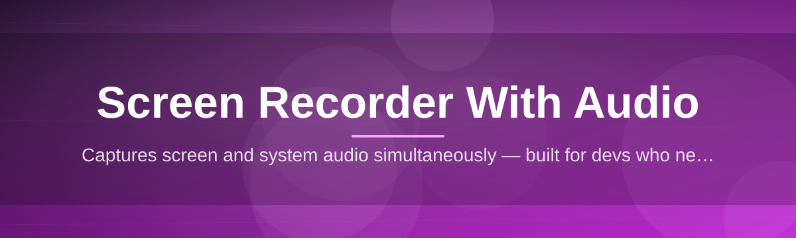
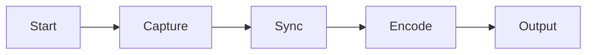

# screen-recorder-audio-suite 🎙️🎬

  

*Capture your screen and your voice, in perfect sync, without wrestling with fifteen checkboxes first.*

  

## 🌱 Overview

This started as a weekend itch-scratch and turned into something I genuinely can't stop tinkering with. **screen-recorder-audio-suite** is a lightweight, standalone screen recorder with audio built for people who want to hit record and actually start recording — tutorials, bug reports, gameplay clips, stand-up demos, async Loom-style updates for the team, whatever. No sign-up wall, no fifteen-tab settings menu, no "trial watermark" nonsense. Just a clean recorder that captures your screen and your microphone (or system audio, or both) in sync, and gets out of your way.

I built this because every other screen recorder with audio I tried either bundled a cloud account I didn't ask for, throttled recording length, or handled audio sync so badly that a 10-minute tutorial ended up drifting half a second by the end. That drift is a silent killer for tutorial makers and streamers alike — you don't notice it until you're editing at 2am wondering why your narration is talking about a step that already happened. So this project leans hard into one thing: rock-solid screen + audio capture that just works on Windows, with zero dependencies to install first.

Who's this for? Developers recording quick demo GIFs and bug repros, teachers recording lecture walkthroughs, streamers doing local backups, indie devs (like me) recording devlogs, and anyone who's tired of screen recording software that feels like it was designed by a committee. If that's you — welcome, I built this for us.

> [!NOTE]
> This is a passion project maintained by one very caffeinated developer. Issues and PRs are read with genuine excitement, not corporate obligation.

---

## ⚡ What It Actually Does

Not a bullet dump — here's the real breakdown of what makes this screen recorder with audio different from the fifty other tabs you probably have open right now.

| Capability | Why It Matters |
|---|---|
| **Synced Dual-Audio Capture** | Records microphone and system/desktop audio as separate or merged tracks, so your narration never drifts from your screen action. |
| **Zero-Install Portable Mode** | Runs straight off a single executable — no installer wizard, no registry bloat, no "please restart your computer" prompts. |
| **Region & Window Targeting** | Draw a custom capture box, snap to a specific window, or go full multi-monitor — the recorder tracks the region even if the window moves. |
| **Adaptive Frame Encoding** | Automatically balances quality vs. file size on the fly, so a 20-minute walkthrough doesn't turn into a 4GB monster by default. |
| **Instant Clip Trimming** | A built-in scrubber lets you chop dead air off the start/end the second recording stops — no separate editor required. |
| **Hotkey-First Workflow** | Start, pause, stop, and snapshot all live on global keyboard shortcuts, because reaching for a mouse mid-demo breaks your flow. |
| **Low-Latency Preview Overlay** | A subtle on-screen indicator shows you're live-recording without eating into your actual capture area. |
| **Local-Only by Design** | Nothing leaves your machine unless you export it yourself — your recordings are yours, full stop. |

> [!TIP]
> Pair **Region & Window Targeting** with **Hotkey-First Workflow** — you can lock onto a window and toggle recording without ever touching the mouse. It's the combo I use for every devlog.

---

## 🚀 Getting Started in Under a Minute

1. Head over to the landing page using the download button above.

2. Grab the latest build — it's a single portable executable, no bundled installer junk.

3. Launch it. Windows SmartScreen might flag it since it's a smaller indie tool — click "More info" → "Run anyway."

4. Pick your capture region, pick your audio sources, hit the record hotkey, and you're rolling.

> [!IMPORTANT]
> Because this ships as a standalone build rather than a signed store app, first-run security prompts are expected. That's normal for indie tooling — not a red flag.

---

## 🖥️ System Requirements

<strong>Click to expand full requirements</strong>

- Windows 10 (64-bit) or Windows 11

- No .NET, Python, or runtime dependencies to install separately

- Minimum 4GB RAM (8GB recommended for high-res multi-monitor capture)

- Any microphone or system audio device recognized by Windows

- ~150MB free disk space for the app, plus space for your recordings

---

## 🧩 How It Works

The pipeline is intentionally simple — fewer moving parts means fewer sync bugs, which was the whole point of building this in the first place.

1. **Trigger** — you press the global hotkey or click record in the UI.

2. **Capture** — the screen buffer and selected audio devices start pulling frames/samples on independent but time-stamped threads.

3. **Sync** — a shared clock stamps every frame and audio chunk so they can be reassembled without drift, even on longer recordings.

4. **Encode** — frames and audio get muxed together in real time using an adaptive bitrate encoder.

5. **Export** — the finished file lands in your output folder, ready to trim, share, or edit further.

---

## 🩺 Troubleshooting

**Q: My audio is slightly out of sync with the video — what gives?**
> Almost always a device sample-rate mismatch. Set your microphone and system audio to the same sample rate (48kHz recommended) in Windows Sound settings before recording.

**Q: Windows says the app is "unrecognized" — is this safe?**
> Yes — this is a small independently published tool, not a widely-signed commercial app, so SmartScreen flags it by default. The source and build process are fully open in this repo.

**Q: My recording is choppy on a high-refresh-rate monitor.**
> Try lowering the capture frame rate in settings, or switch to Window Targeting mode instead of full-monitor capture — it's lighter on resources.

**Q: No system audio is being captured, only my mic.**
> Make sure you've enabled the desktop/loopback audio source in the audio panel — mic-only is the default to avoid accidentally recording background noise.

**Q: Can I record multiple monitors at once?**
> Yes, select "All Displays" in the region picker. Note this increases file size and CPU load significantly.

**Q: The app won't launch after antivirus scan.**
> Some antivirus heuristics are overly aggressive with new portable executables. Whitelisting the app folder resolves this in nearly all reported cases.

---

## 🎨 UI / UX Details

> [!TIP]
> Everything below can be remapped in **Settings → Shortcuts**.

| Action | Default Shortcut |
|---|---|
| Start / Stop Recording | `Ctrl + Alt + R` |
| Pause / Resume | `Ctrl + Alt + P` |
| Snapshot Frame | `Ctrl + Alt + S` |
| Toggle Mic Mute | `Ctrl + Alt + M` |
| Open Region Picker | `Ctrl + Alt + Q` |

- **Themes**: Light, Dark, and an "Auto" mode that follows your Windows theme.

- **Recording Indicator**: a minimal, draggable overlay badge — doesn't block your capture area.

- **Output Settings**: choose MP4/H.264 or a lighter compression profile, plus custom output folder.

- **Notification Sounds**: subtle start/stop chimes, toggleable if you're recording something sensitive to background noise.

---

## 🤝 Contributing & Community

> [!NOTE]
> This project genuinely grew out of a personal need, and I'd love for it to grow with contributors who care about the same problem — clean, drift-free screen recording with audio.

- Found a bug? Open an issue with your Windows version, audio device setup, and repro steps.

- Got a feature idea? Discussions are open — I read every single one.

- Want to contribute code? Fork, branch, and open a PR. Small, focused PRs get reviewed fastest.

- Star the repo if this saved you from another bloated recording app — it genuinely keeps this project alive.

---

## 📄 License

Released under the [MIT License](LICENSE) — 2026. Use it, fork it, build on it, ship your own spin of it.

---

## ⚠️ Disclaimer

This software is provided "as is," without warranty of any kind. It's an independent, community-driven project and is not affiliated with Microsoft or any other platform vendor. Always review your local recording laws and workplace policies before capturing screen or audio content involving other people.

> [!WARNING]
> Recording audio or screen content of third parties without consent may violate privacy laws in your jurisdiction. This tool is provided for legitimate personal, educational, and professional use.

